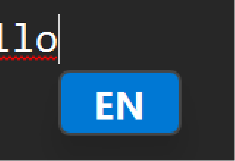
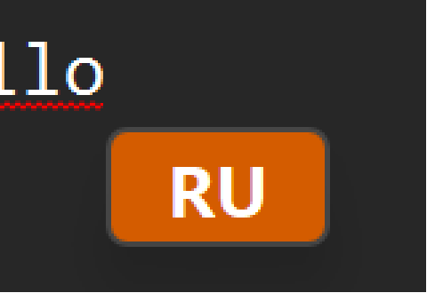

# ahk-layout-switch

Two small AutoHotkey scripts that make typing in several languages on Windows feel the
same as on a Mac, so your fingers don't have to re-learn anything when you move between
the two.

| Script | What it does |
|---|---|
| `layout-tooltip.ahk` | Shows the layout code (`EN`, `DE`, …) in a small badge right under the text caret every time the keyboard layout changes. The Windows counterpart of macOS' *Show input source indicator near the caret*. |
| `layout-switch.ahk` | Cycles through *your* list of languages with one hotkey (Ctrl+Space by default, like macOS) and jumps to a language directly with another. Ignores layouts you don't use. |

Both are AutoHotkey v2 and independent: run one or both.

 

## Why

If you touch-type in two or more languages you don't look at the taskbar. On a Mac the
current input source pops up right where you are typing, so a wrong layout is caught before
the first word. Windows only shows it in the tray, far from the caret, and the default
hotkeys (Win+Space, Alt+Shift) don't match Ctrl+Space muscle memory. These scripts close
that gap.

## Requirements

- Windows 10 or 11.
- [AutoHotkey](https://www.autohotkey.com/) v2.0.
- `layout-tooltip.ahk` needs `lib/UIA.ahk` next to it (bundled, see Credits).

## Install

1. Clone or download this repository.
2. Open the script you want. Edit the **Configuration** block at the top of each file (see
   below), save.
3. Double-click the script. To start it at logon, put a shortcut into
   `shell:startup` or create a scheduled task.

To use them inside your own v2 script instead of running them standalone:

```autohotkey
#Include path\to\layout-tooltip.ahk      ; badge starts on its own
#Include path\to\layout-switch.ahk       ; only defines the Layout class
^Space::Layout.Cycle(["EN", "DE"])
^+2::Layout.Set("DE")
```

## Configure

Both scripts keep every setting in a clearly marked block at the top of the file. The
default language set is **English + German**.

### `layout-tooltip.ahk`

```autohotkey
global LT_LANG := Map(
    0x0409, ["EN", "accent"],       ; English (US)
    0x0407, ["DE", "complement"],   ; German
)
```

- The key is the Windows language ID (low word of the layout handle):
  `0x0409` English (US), `0x0407` German, `0x040C` French, `0x0419` Russian, `0x0410`
  Italian, `0x0C0A` Spanish… Full list:
  [Language Identifier Constants](https://learn.microsoft.com/windows/win32/intl/language-identifier-constants-and-strings).
- The label is what the badge shows. Any short text works.
- The colour is a shade of your **system accent colour** (`light3` … `accent` … `dark3`),
  `complement` (accent with its hue rotated by 180°, orange for a blue accent), or a
  literal `RRGGBB`. Text turns white or black automatically. Change the accent in
  Windows Settings and the badge follows.
- Languages not in the map still get a badge: their ISO code (`FR`, `IT`, …) on the
  `LT_OTHER_SHADE` colour.

Timing: `LT_SHOW_DELAY` (50 ms after the switch), `LT_HIDE_DELAY` (300 ms on screen),
`LT_MAX_LOOKUP` (if finding the caret takes longer than 100 ms the badge is skipped,
because it would already be late).

### `layout-switch.ahk`

```autohotkey
global Languages     := ["EN", "DE"]                   ; cycle order, ISO 639 codes
global CycleHotkey   := "^Space"                       ; Ctrl+Space, macOS style
global DirectHotkeys := Map("^+1", "EN", "^+2", "DE")  ; Ctrl+Shift+1 / +2, or Map() to disable
```

Hotkey syntax is AutoHotkey's: `^` Ctrl, `!` Alt, `+` Shift, `#` Win. `CapsLock` is a
popular alternative for the cycle hotkey. A language must be installed in Windows to be
selectable. Switching applies to the active window only, exactly like Windows' own
switching.

## How the badge finds the caret

There is no single Windows API for "where is the caret", so the script tries three
documented sources in order and takes the first hit:

1. `GetGUIThreadInfo` — classic Win32 caret (Notepad, Explorer, Office, Sublime, WinForms,
   the classic console).
2. The window's own MSAA caret object, asked via `WM_GETOBJECT` — Chromium and Electron
   apps (Edge, Chrome, VS Code, Telegram, Slack…).
3. UI Automation `TextPattern` — WinUI/UWP controls, Windows Terminal, the Win+S search
   box.

If nothing answers (GPU-rendered apps such as Warp, games) the badge appears under the
mouse pointer instead. The badge follows the caret while it is visible and is positioned
in physical pixels, so it stays put on multi-monitor setups with different scaling.

The badge window is created with `CreateWindowInBand`, an undocumented `user32` export,
so that it can be drawn on top of Win+S, the Start menu and the notification centre, which
sit above every ordinary always-on-top window. If the call is unavailable the script falls
back to a normal window and simply can't overlay those shell surfaces.

## Known limitations

- The very first badge in a freshly started app may be skipped: the app's accessibility
  tree is built on the first query, which can take longer than the 100 ms budget. Every
  later switch is instant.
- Apps that draw their own text without any accessibility support (Warp terminal, most
  games) get the mouse-pointer fallback.
- The classic console (`conhost`) reports no layout for its window; the script finds the
  hosting `conhost.exe` thread through Toolhelp once per window and caches it.

## Credits

- `lib/UIA.ahk` is [UIA-v2](https://github.com/Descolada/UIA-v2) by Descolada, MIT
  licence.

## License

MIT, see [LICENSE](LICENSE).
